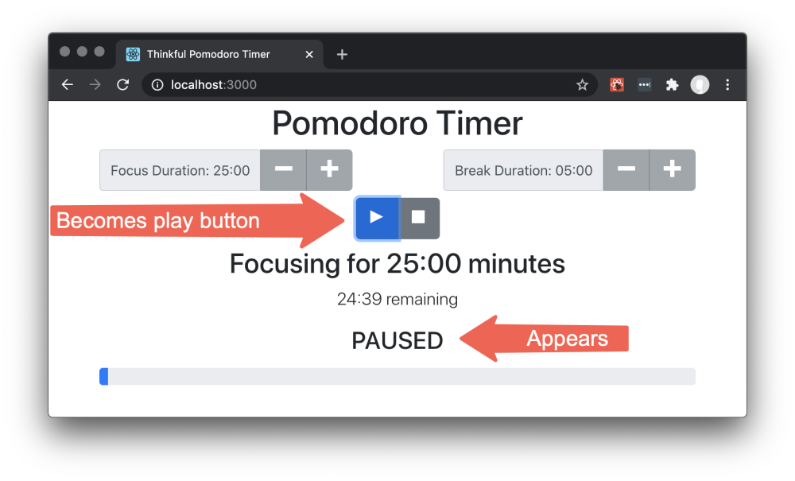

# Pomodoro Timer

> The Pomodoro Technique is a time management method developed by Francesco Cirillo in the late 1980s.
The technique uses a timer to break down work into intervals, traditionally 25 minutes in length, separated by short breaks. Each interval is known as a pomodoro, from the Italian word for 'tomato', after the tomato-shaped kitchen timer that Cirillo used as a university student.



## Project setup

Follow the instructions below to get this project up and running on your own machine:

- Fork and clone this repository.
- Run `npm install` to install the dependencies needed for this project.

To run the tests, you can run the following command:

```bash
npm test
```

To watch how the code you write affects the application website, you can run the following command, which will start a server and take over your terminal window:

```bash
npm start
```

To stop the server and regain control of your terminal, you can press `Ctrl + C`.